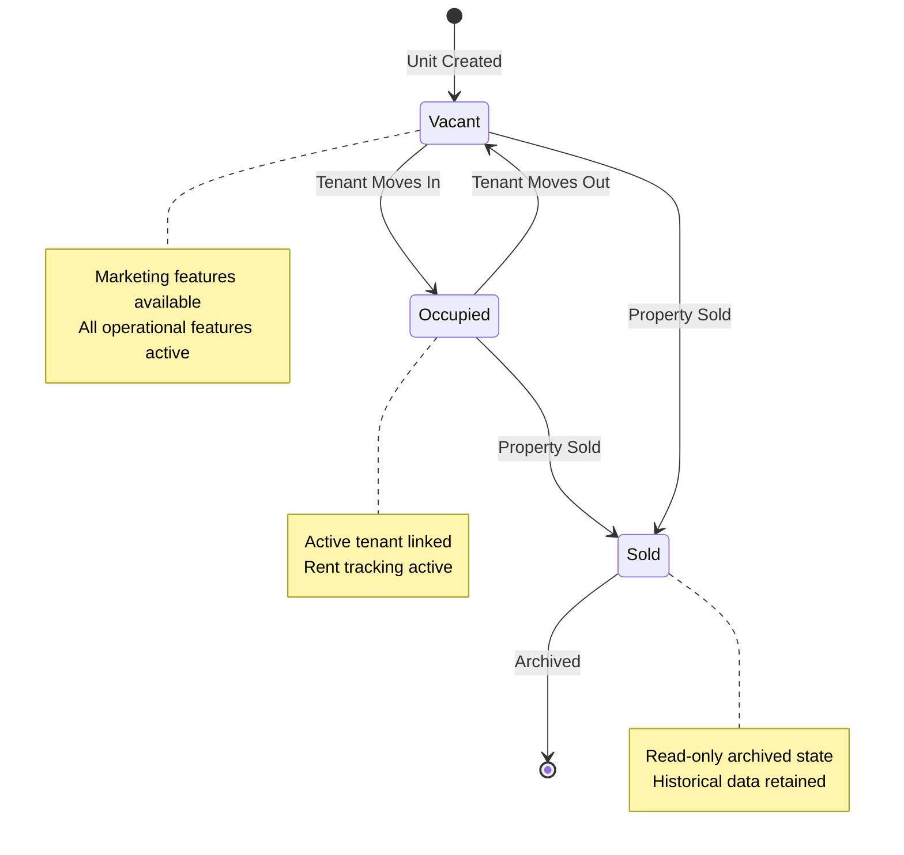
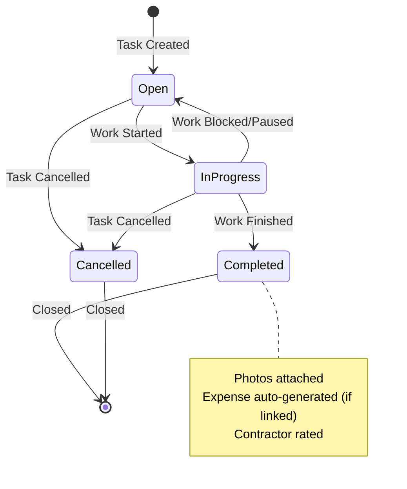
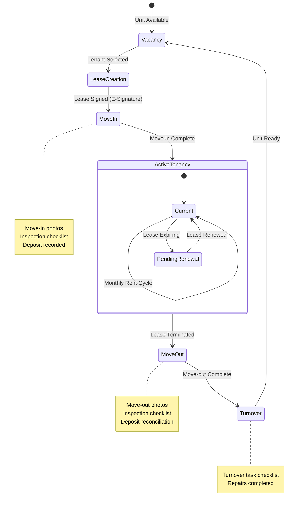
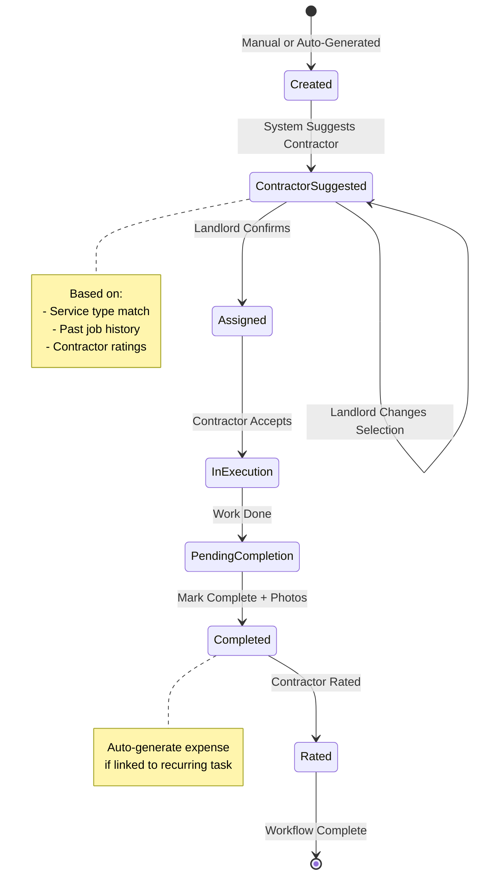
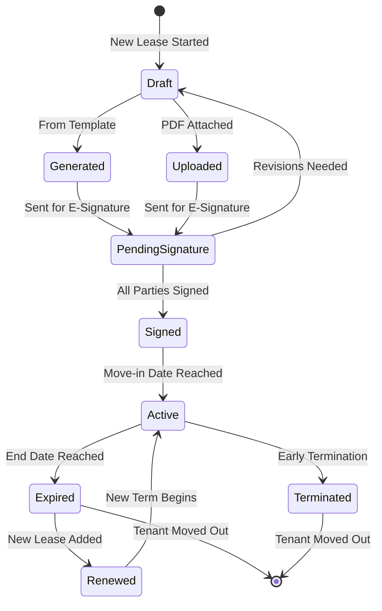
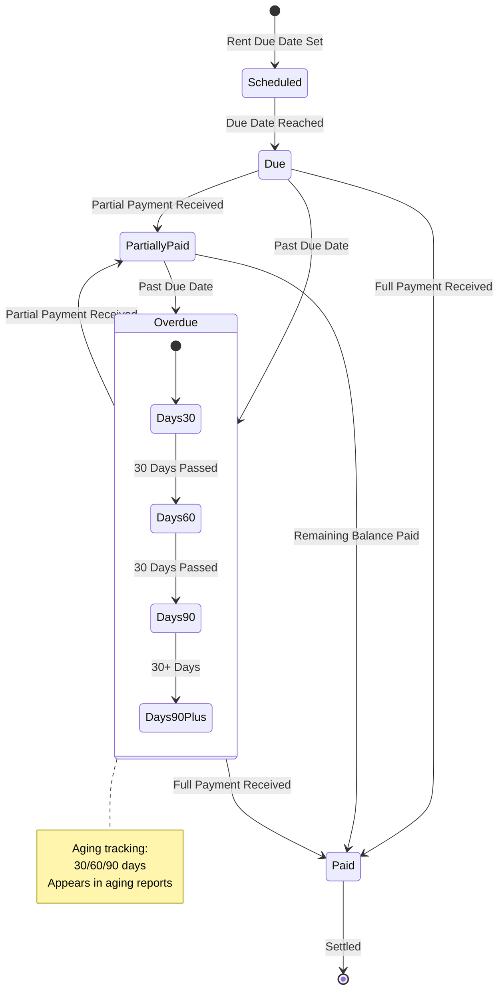
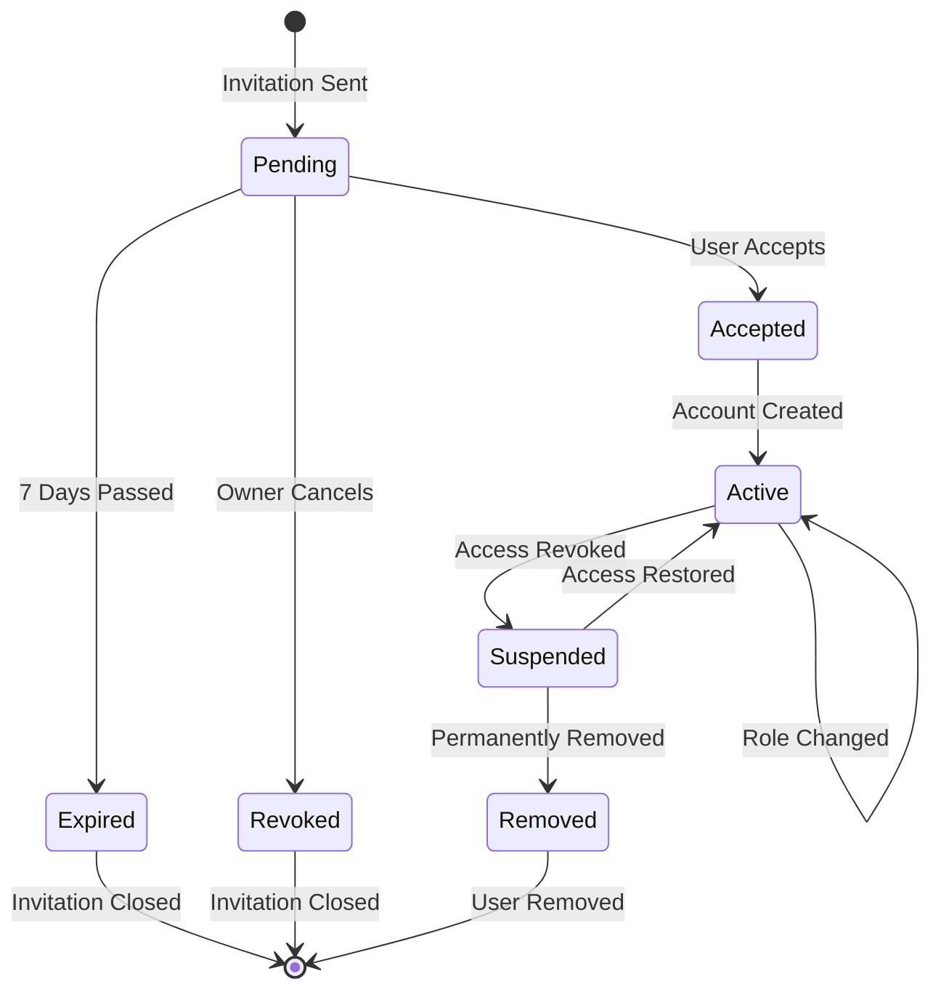
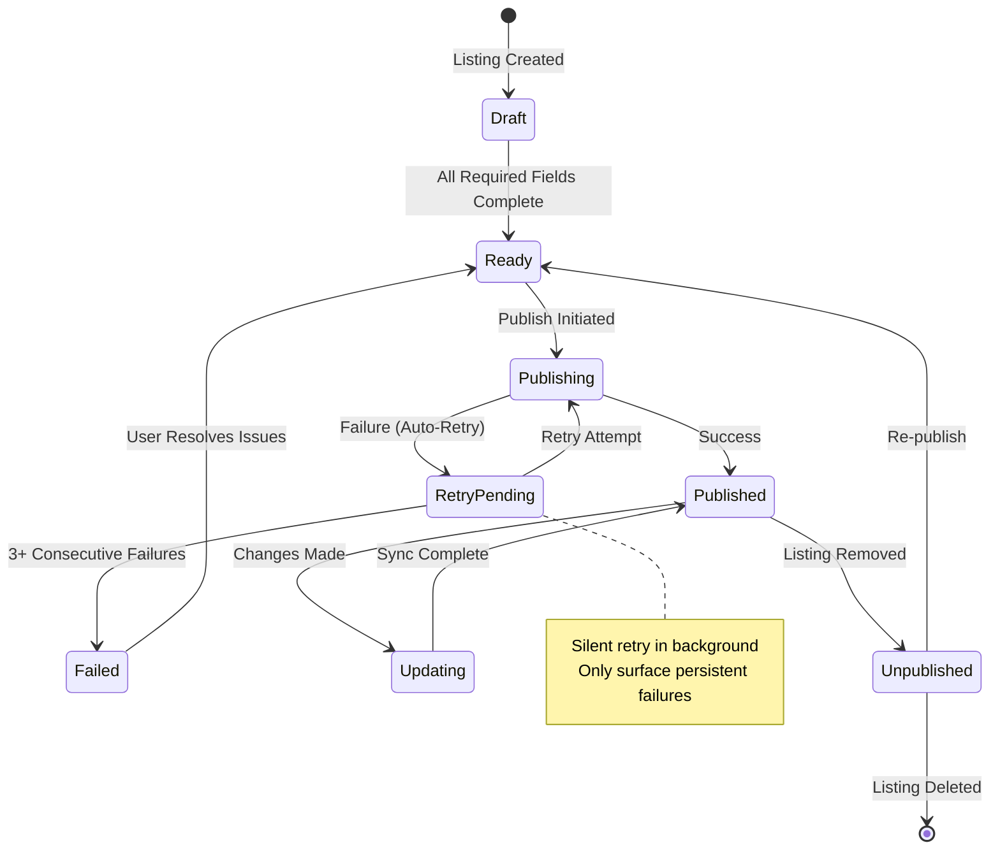

# Landlord - Property Management SaaS

## Executive Summary

Landlord is a property management CRM designed for landlords managing single-family residential portfolios. The platform serves as a centralized hub for managing units, tenants, contractors, finances, and maintenance—targeting professional landlords with portfolios of 50-200+ units.

**Business Model:** SaaS with per-unit monthly pricing. All features included at a single tier.

**Platforms:** Web application + native iOS/Android mobile apps with full feature parity but field-optimized mobile UX.

---

## Technical Architecture

### Recommended Stack

| Layer | Technology | Rationale |
|-------|------------|-----------|
| Database | PostgreSQL via Supabase | Complex relational model (AR/AP, audit trails, tenant history), Row Level Security for multi-tenant isolation |
| Backend | Supabase + Edge Functions | Auth, real-time subscriptions, serverless compute |
| Web Frontend | Next.js 14+ (App Router), TypeScript, Tailwind CSS, shadcn/ui | Server components, API routes, strong typing |
| Mobile | React Native (Expo) | Shared business logic with web, offline-capable |
| Payments | Stripe | Per-unit subscription billing |
| File Storage | Cloudflare R2 or AWS S3 | Photos, documents, receipts |
| Email | Resend | Digest notifications |
| Hosting | Vercel (web), EAS (mobile builds) | Seamless deployment |

### Offline Capability

- **Read-only offline mode:** Users can view all cached data without internet
- **Changes require connectivity:** Create/edit operations queue until online
- **Sync strategy:** Optimistic UI with background sync when reconnected

---

## Core Data Model

### Primary Entities

```
Portfolio (implicit - user's entire set of properties)
├── Building (optional container for multi-unit properties)
│   └── Unit (primary entity)
│       ├── Tenant (linked tenancy records with lease history)
│       ├── Lease (structured legal documents)
│       ├── Asset (appliances, systems with receipts)
│       ├── Photo (timestamped + event-based albums)
│       ├── Task (work orders, maintenance)
│       ├── Transaction (AR/AP ledger entries)
│       └── Note (free text per entity)
├── Contractor (global, shared across all units)
└── User (with role-based access)
```

### Entity Details

#### Unit
The primary object in the system. Represents a single rentable residence.

| Field Category | Description |
|----------------|-------------|
| Basic Info | Address, bedrooms, bathrooms, square footage, year built |
| Status | Occupied/Vacant/Sold (archived) |
| Legal Info | Structured lease fields + document attachments |
| Marketing Info | Listing description, rental price, photos, amenities |
| Financial Info | AR/AP ledger, expected rent, deposit held |
| Maintenance Info | Preferred contractors by service type |
| Assets | Appliances and systems with full lifecycle tracking |
| Utilities | Account numbers, responsibility assignment (landlord vs tenant) |
| Notes | Single free-text notes field |

**Vacancy Handling:** No enforced mode changes. Vacant is simply a tenant status. All features remain available regardless of occupancy.

**Unit Disposal:** When a unit is sold, it is marked as "sold/inactive" and archived in place. All historical data is retained for records.

#### Building (Multi-Unit Container)
Optional grouping for units that share physical space or costs.

| Field | Description |
|-------|-------------|
| Name | Building identifier |
| Address | Physical address |
| Units | Associated unit records |
| Shared Expenses | Expenses split across units by fixed percentage |

**Cost Splitting:** Fixed percentages set manually per unit (e.g., Unit A: 60%, Unit B: 40%). Applied to expenses tagged as "shared."

**Shared Amenities:** Not tracked separately. All income attributed to individual units.

#### Tenant
Represents a person or entity renting a unit. Linked tenancy model—one tenant record can have multiple lease periods.

| Field | Description |
|-------|-------------|
| Name | Full legal name |
| Contact | Phone, email, emergency contact |
| Lease History | Array of lease records (start date, end date, rent amount, terms) |
| Timeline | Customizable event log (user configures which event types appear) |
| Notes | Single free-text field |

**Tenant History:** Full timeline maintained. When tenants renew, a new lease record is added to the same tenant, not a new tenant record.

**Future Consideration:** System designed to accommodate future tenant portal (maintenance requests, payment tracking, lease viewing).

#### Lease
Structured legal document associated with a tenant.

| Field | Description |
|-------|-------------|
| Start Date | Lease commencement |
| End Date | Lease termination |
| Rent Amount | Monthly rent due |
| Security Deposit | Amount held (basic tracking—amount and return date only) |
| Terms | Custom terms and conditions |
| Document | PDF attachment or generated from template |

**Lease Templates:** System supports generating leases from templates with auto-population of unit/tenant data.

**E-Signatures:** Integration with DocuSign or HelloSign for legally valid electronic signatures.

#### Asset (Unit Equipment)
Tracks appliances and systems within a unit with full lifecycle management.

| Field | Description |
|-------|-------------|
| Name | Asset description (e.g., "Kitchen Refrigerator") |
| Make/Model | Manufacturer and model number |
| Serial Number | For warranty and service |
| Purchase Date | Acquisition date |
| Purchase Price | Cost basis |
| Warranty Expiry | End of warranty coverage |
| Expected Lifespan | Typical replacement timeframe |
| Documents | Receipts, warranty docs, manuals (receipt vault) |
| Maintenance Log | Service history for this specific asset |

#### Photo
Media management with dual organization: timestamped archive AND event-based albums.

| Field | Description |
|-------|-------------|
| File | Image file stored in cloud |
| Timestamp | Upload date/time |
| Event Type | Move-in, Move-out, Maintenance, Inspection, General |
| Caption | Optional description |
| Unit | Associated unit |

**Organization:**
- All photos timestamped and archived permanently
- Photos grouped into albums by event type
- Searchable by date range and event type

#### Task (Work Order)
Maintenance requests and work orders.

| Field | Description |
|-------|-------------|
| Title | Brief description |
| Description | Full details |
| Unit | Associated unit |
| Status | Open, In Progress, Completed, Cancelled |
| Priority | User-configurable priority levels per task type |
| Due Date | Expected completion |
| Assigned Contractor | Suggested or assigned vendor |
| Linked Expense | Optional: auto-generate expense entry on completion |
| Photos | Before/after documentation |

**Task Automation:** Simple interval-based scheduling (e.g., "HVAC filter every 90 days"). No smart scheduling based on asset age or season.

**Contractor Assignment:** System suggests contractor based on:
1. Service type match
2. Past job history for this unit/user
3. Contractor ratings from past jobs

Landlord confirms or changes assignment manually.

**Contractor Follow-up:** Manual only. No automatic reminders or escalation.

**Recurring Expenses:** When recurring tasks complete, they can auto-generate corresponding expense entries in the ledger.

#### Transaction (Financial Ledger)
Full Accounts Receivable/Accounts Payable tracking.

| Field | Description |
|-------|-------------|
| Date | Transaction date |
| Type | Income or Expense |
| Category | IRS-compatible categorization for Schedule E |
| Amount | Dollar value (USD only) |
| Expected Amount | For AR: scheduled rent due |
| Actual Amount | What was actually received/paid |
| Balance | Running balance (arrears tracking) |
| Unit | Associated unit |
| Tenant | Associated tenant (for income) |
| Contractor | Associated contractor (for expenses) |
| Notes | Free text |
| Audit Trail | Automatic: who changed what, when |

**Payment Handling:**
- Accept any payment amount (no enforcement of full payment)
- System tracks remaining balance automatically
- Aging reports for overdue amounts

**Dispute Handling:** Edit records in place. Full audit trail captures all changes with timestamps and user attribution.

**Recurring Expenses:** Linked to task completion. When a recurring task is marked complete, associated expense entry is auto-generated.

#### Contractor
Global vendor records shared across all units.

| Field | Description |
|-------|-------------|
| Name | Business or individual name |
| Contact | Phone, email, address |
| Service Types | Plumbing, Electrical, HVAC, etc. |
| Rating | Aggregate rating from past jobs |
| Job History | Past work orders completed |
| Payment History | For 1099 tracking |
| Notes | Single free-text field |

**Scope:** Contractors are global. Same rates and terms apply across all units (no per-unit negotiated rates).

---

## User Management

### Roles

| Role | Permissions |
|------|-------------|
| Owner | Full access to all features, data, and settings |
| Manager | Full operational access, cannot view financials or delete records |
| Viewer | Read-only access (for accountants, investors) |

### Authentication
- Email/password authentication
- OAuth support (Google, Apple) for convenience
- SSO for future enterprise customers

### Multi-User
- Multiple users can access same portfolio
- All actions attributed to specific user in audit trail
- Invitations sent via email

---

## Key Workflows

### Unit Onboarding (Progressive Disclosure)

Start with minimal required information, prompt to add more detail over time.

**Step 1 - Required:**
- Address
- Property type
- Bedrooms/Bathrooms

**Prompted Later:**
- Add tenant information
- Upload photos
- Add assets
- Set up maintenance schedule
- Configure marketing details

System surfaces prompts contextually (e.g., "Add a tenant?" when viewing an occupied-status unit with no tenant record).

### Inspection Templates

Pre-built checklists for common inspection types:
- Move-in inspection
- Move-out inspection
- Quarterly/Annual inspection
- Specific system inspections (HVAC, plumbing)

Each template includes:
- Room-by-room checklist items
- Required photo documentation per item
- Condition rating scale
- Notes field per item
- Generate PDF report

### Work Order Workflow

1. **Create Task:** Manual creation or auto-generated from recurring schedule
2. **Contractor Suggestion:** System recommends contractor based on service type, history, and ratings
3. **Assignment:** Landlord confirms or changes assignment
4. **Execution:** Contractor completes work
5. **Completion:** Mark complete, attach photos, auto-generate expense if linked
6. **Rating:** Rate contractor performance (affects future suggestions)

### Tenant Lifecycle

1. **Vacancy:** Unit marked vacant, marketing tools available
2. **Application:** (External - screening out of scope)
3. **Lease Creation:** Generate from template or upload, send for e-signature
4. **Move-In:** Record move-in date, capture move-in photos, inspection checklist
5. **Tenancy:** Rent tracking, maintenance requests, communication
6. **Renewal:** Add new lease period to existing tenant record
7. **Move-Out:** Capture move-out photos, inspection, deposit reconciliation
8. **Turnover:** Generate turnover task checklist

---

## Financial Features

### Ledger Structure

Simple income/expense ledger with AR/AP tracking capabilities.

**Income Categories:**
- Rent
- Late Fees
- Pet Fees
- Parking
- Utilities Reimbursement
- Other Income

**Expense Categories (IRS Schedule E aligned):**
- Advertising
- Auto and Travel
- Cleaning and Maintenance
- Commissions
- Insurance
- Legal and Professional Fees
- Management Fees
- Mortgage Interest
- Other Interest
- Repairs
- Supplies
- Taxes
- Utilities
- Depreciation
- Other

### AR/AP Features

- Track expected vs actual payments
- Running balance per tenant
- Aging reports (30/60/90 days)
- Payment plan tracking

### Tax Reporting

- Schedule E summary report
- Contractor payment summaries (for 1099 preparation)
- Year-end financial reports
- Export to PDF and CSV

**Note:** System does not generate or file 1099s directly. Provides payment summaries for external filing.

### Accounting Integration

One-way export to QuickBooks and Xero:
- Push transactions on demand or scheduled
- Landlord system remains source of truth for property data
- Accounting software is source of truth for final financials
- No two-way sync (avoids conflict complexity)

---

## Notifications

### Email Digest

Daily or weekly email summary (user-configurable frequency) including:
- Rent due in next 7 days
- Overdue rent payments
- Leases expiring in next 30/60/90 days
- Overdue tasks
- Upcoming scheduled maintenance
- Inspection due dates

**No real-time push notifications in V1.** Dashboard alerts for in-app awareness.

---

## Marketing & Listings

### Listing Management

Per-unit marketing configuration:
- Listing title and description
- Rental price
- Pet policy
- Amenities checklist
- Photo selection for listing
- Virtual tour link

### Platform Integrations

API integrations with:
- **Zillow** (Zillow Rental Manager API)
- **Apartments.com** (CoStar API)

**Sync Behavior:**
- Silent retry on failure
- Auto-retry in background
- Only surface persistent failures (3+ consecutive failures)

**Future:** Expand to Realtor.com, Trulia, Zumper based on demand.

---

## Search & Navigation

### Global Search

Single search bar that searches across:
- Units (address, notes)
- Tenants (name, contact info)
- Contractors (name, business name)
- Tasks (title, description)

Results grouped by entity type. Click to navigate directly.

### Dashboard

**Primary Focus:** Portfolio overview with key metrics:
- Total units
- Occupancy rate
- Monthly expected income
- Monthly actual income
- Cash flow (income - expenses)
- Overdue rent total
- Open tasks count

Secondary section: Action items requiring attention.

---

## Reports & Exports

### Report Types

| Report | Description | Format |
|--------|-------------|--------|
| Portfolio Summary | All units, occupancy, financials | PDF |
| Unit Detail | Single unit complete history | PDF |
| Income Statement | Period income by category | PDF, CSV |
| Expense Report | Period expenses by category/unit | PDF, CSV |
| Rent Roll | All tenants, rent amounts, status | PDF, CSV |
| Aging Report | Overdue receivables by tenant | PDF, CSV |
| Schedule E Summary | Tax-ready expense categorization | PDF, CSV |
| Contractor Payments | Annual payments per contractor | PDF, CSV |
| Task History | Completed work by unit/period | PDF, CSV |

### Export Formats

- **PDF:** Human-readable reports for printing/sharing
- **CSV/Excel:** Raw data for accountants or custom analysis
- **QuickBooks/Xero:** Direct API export

---

## Audit Trail

### Scope

Full audit trail on all changes:
- Financial transactions (all changes)
- Tenant records (all changes)
- Lease modifications
- Task status changes
- User permission changes

### Audit Record Structure

| Field | Description |
|-------|-------------|
| Timestamp | When change occurred |
| User | Who made the change |
| Entity Type | What was changed (Unit, Tenant, Transaction, etc.) |
| Entity ID | Specific record |
| Action | Create, Update, Delete |
| Previous Value | Before state (JSON) |
| New Value | After state (JSON) |

### Retention

Audit records retained indefinitely. Not deletable by users.

---

## Security & Compliance

### Data Isolation

- Row Level Security (RLS) in PostgreSQL
- Each organization's data completely isolated
- No cross-tenant data access possible

### Authentication

- Secure password hashing (bcrypt)
- Session management with secure tokens
- Optional 2FA (future)

### Data Protection

- All data encrypted in transit (TLS 1.3)
- Data encrypted at rest
- Regular automated backups
- Point-in-time recovery capability

### PII Handling

- Tenant SSNs: NOT stored (screening out of scope)
- Financial account numbers: NOT stored
- Contact information: Encrypted at rest

---

## Mobile App Specifics

### Feature Parity

All web features available on mobile. No feature gating by platform.

### Field-Optimized UX

Mobile UI optimized for common field tasks:
- Quick photo capture (goes directly to unit's photo album)
- Task completion with photo attachment
- Tenant contact (tap-to-call, tap-to-text)
- Unit lookup by address
- Inspection checklist completion

### Offline Behavior

- All data cached locally for read access
- Queue changes when offline
- Sync automatically when connection restored
- Clear visual indicator of offline state
- Conflict resolution: Last write wins (with audit trail)

---

## API & Integrations

### External Integrations

| Service | Direction | Purpose |
|---------|-----------|---------|
| DocuSign/HelloSign | Bi-directional | Lease e-signatures |
| Zillow Rental Manager | Outbound | Listing syndication |
| Apartments.com | Outbound | Listing syndication |
| QuickBooks | Outbound | Accounting export |
| Xero | Outbound | Accounting export |
| Stripe | Bi-directional | Subscription billing |

### Future Integrations (Not in V1)

- Tenant screening (TransUnion, Experian)
- Rent payment processing
- Additional listing platforms
- Home warranty services

---

## Pricing Model

### Per-Unit Pricing

- Monthly subscription based on unit count
- All features included (no tiers)
- Pricing TBD based on market research

### Billing

- Stripe subscription management
- Monthly or annual billing options
- Proration on unit count changes
- Usage calculated on active (non-archived) units only

---

## Out of Scope (V1)

The following features are explicitly NOT included in V1:

- Tenant portal (designed for, but not built)
- Tenant screening integration
- Rent payment processing
- Bulk operations / batch processing
- CSV data import
- AI-powered insights or recommendations
- Automatic contractor follow-up/escalation
- Smart maintenance scheduling
- Multi-currency support
- 1099 generation/filing
- Two-way accounting sync

---

## Success Metrics

### User Engagement

- Weekly active users
- Units managed per user
- Tasks created/completed per month
- Time spent in app

### Business Metrics

- Monthly recurring revenue (MRR)
- Customer acquisition cost (CAC)
- Lifetime value (LTV)
- Churn rate
- Net revenue retention

### Product Quality

- Page load times < 2s
- Mobile app crash rate < 0.1%
- API uptime > 99.9%
- Support ticket volume

---

## Development Phases (Suggested)

### Phase 1: Core Foundation
- User auth and organization setup
- Unit CRUD with basic info
- Building container
- Tenant management with lease tracking
- Basic financial ledger

### Phase 2: Operations
- Task/work order system
- Contractor management
- Photo management with event albums
- Asset tracking with receipts

### Phase 3: Financial Depth
- Full AR/AP with aging
- Tax reporting
- QuickBooks/Xero export

### Phase 4: Growth Features
- Inspection templates
- Lease template generation
- DocuSign integration
- Listing syndication (Zillow, Apartments.com)

### Phase 5: Polish
- Mobile apps
- Offline capability
- Email digest notifications
- Global search
- Dashboard refinements

---

---

## State Machine Diagrams

### Unit Status States

Units have three primary states representing their lifecycle status.



### Task/Work Order States

Tasks (work orders) progress through four states from creation to resolution.



### Tenant Lifecycle States

Represents the full lifecycle of a tenant relationship with a unit.



### Work Order Workflow States

Detailed workflow for handling maintenance and work orders.



### Lease Document States

Lifecycle of a lease document from creation through signature.



### Transaction/Payment States

AR (Accounts Receivable) transaction states for rent and income tracking.



### User Invitation States

Multi-user access invitation workflow.



### Listing Syndication States

State machine for property listing publication to external platforms.



---

*Specification Version: 1.0*
*Generated: Based on detailed product interview*
